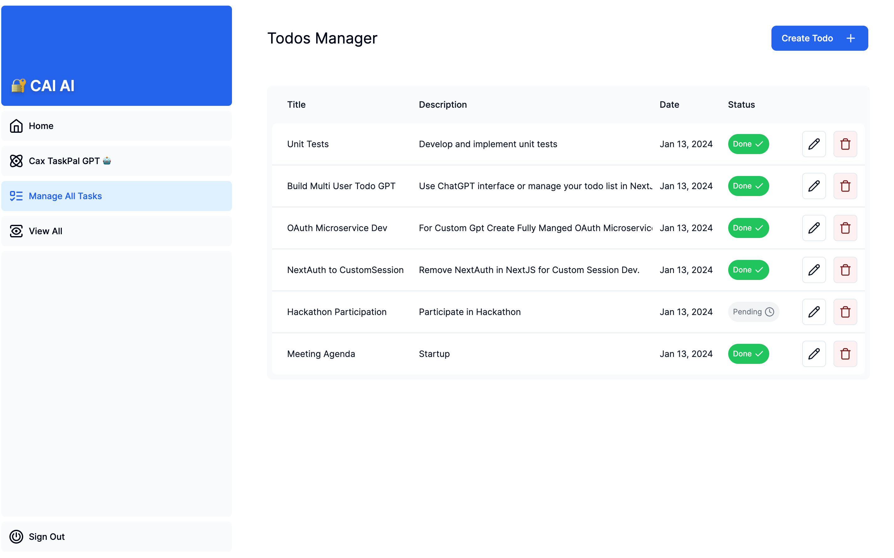
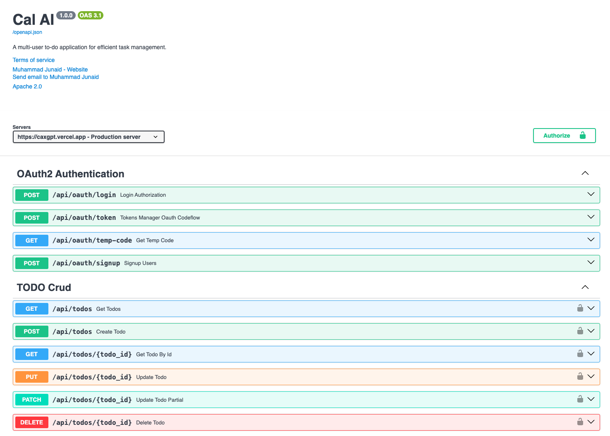

# CalX: Applied GenAI Multi User Todo App

#### Built in NextJS14 Fastapi and deployed on Vercel

A Complete API Microservice and Web App deployed on VERCEL. Active development to add Applied GenAI features is continued for it :D

    - Checkout it's readme for all development, getting started, features and deployment details

##### NextJS User Dashboard



#### NextJS FastAPI Endpoints



#### GenAI features are In Progress!

## Features And Tech Stack

### FastAPI Microservice
- User registration and authentication
- CRUD operations for todos
- Efficently handle Database Connections (open & close sessions for users)
- OAuth protocol to implement authentication and security
- Configured Alembic to generate database schema and run migrations
- SqlAlchemy ORM and Neon Serverless Postgress SQL Database 
- Complete Unit, End to End and Integration tests using pytest and uttitest

- `api`: Contains the FastAPI backend microservice code, including API routes, models, and database configurations.


### NextJS14
- Be Dynamic at the Speed of Static
- Use Server Actions for all User Actions
- Middleware and NextAuth5 to implement user Authentication & Secure Routes
- Streaming and Suspense to enchance UI
- A custom todos management dashboard for all users
- Shad CN Ui and Tailwind Css for UI engineering

## Running the Project Locally 

These instructions will get you a copy of the project up and running on your local machine for development and testing purposes.

1. Clone the repository:
```sh
git clone ....
```

2. Rename .env.example to .env and add misisng environment variables

3. Run pnpm install to install the missing dependencies

4. Run Database Migrations

- `alembic revision --autogenerate -m "Add Todos Table`

- `alembic upgrade head`

5. run pnpm dev and get the project running locally

### Vercel Deplyment

Delete the .next and __pucache__ and .mypy... cache files and follow the steps:

a. Run `vercel link` and then add all env variables to vercel deplyment. Replace the localhost vars with vercel deoloyment link

b. Finally run `vercel --prod` to deploy the project.


## Future Development Roadmap

Here’s what we envision for future updates:

- Advanced AI Features
- Intelligent Task Prioritization: 
- Context-Aware Task Suggestions: 
- Seamless Integration with External Tools
- Smart Calendar Sync


## The Inspiration
Inspired by the need for a personalized, AI-driven task management tool, this project is a journey towards creating an app that not only assists in managing daily tasks but also learns and adapts to the user's lifestyle and preferences.

## Thoughts

Feel free to ask any questions or provide feedback. Contributions are also welcome!


OAuth 2.0 Authorization Code Grant Type

https://developer.okta.com/blog/2018/04/10/oauth-authorization-code-grant-type#:~:text=The%20Authorization%20Code%20Grant%20Type,used%20OAuth%202.0%20grant%20types.

The Token URL Response:

https://community.openai.com/t/guide-how-oauth-refresh-tokens-revocation-work-with-gpt-actions/533147

Understand oauth code flow

https://www.oauth.com/oauth2-servers/single-page-apps/

Authorization Code Grant

https://www.oauth.com/oauth2-servers/server-side-apps/authorization-code/

How OAuth refresh tokens & revocation work with GPT Actions

https://community.openai.com/t/guide-how-oauth-refresh-tokens-revocation-work-with-gpt-actions/533147